# Runtime architecture

This document defines the stable runtime boundary used by the CLI today and reserved for a later desktop sidecar. It describes existing behavior; it does not change installation, release, compatibility, or feature commitments.

## RuntimeFacade

`RuntimeFacade` is the public runtime boundary. It owns the externally visible lifecycle, the public `start()`, `stop(reason)`, `subscribe(listener)`, and `snapshot()` surface, and the translation from internal state to safe runtime events and snapshots. A later desktop sidecar may call **only** these four operations: `start`, `stop(reason)`, `subscribe`, and `snapshot`. It must not access `ActionExecutor`, `TaskController`, `TurnToolBudget`, or Mineflayer directly.

RuntimeFacade depends inward on `WhiteLilyAppLifecycle` for component lifecycle ownership, on `TaskController` for task state and invalidation, and on Minecraft and Codex observers for public state. No lower layer depends on RuntimeFacade. `WhiteLilyAppLifecycle` remains the sole component cleanup executor: RuntimeFacade asks it to stop, but does not clean up its components itself.

`start()` coalesces concurrent starts and is idempotent while running. `stop(reason)` coalesces concurrent stops and is idempotent after `stopped` or `failed`. A stopped or failed facade is terminal: it cannot restart; create a new runtime instance. Startup or stop failure moves the facade to `failed`, and unknown task or Minecraft state fails closed in the public state rather than exposing untrusted data.

```mermaid
stateDiagram-v2
  [*] --> idle
  idle --> starting: start()
  starting --> running: lifecycle start succeeds
  starting --> stopping: stop(reason)
  starting --> failed: start failure
  running --> stopping: stop(reason)
  stopping --> stopped: stop succeeds
  stopping --> failed: stop failure
  failed --> [*]: terminal; no restart
  stopped --> [*]: terminal; no restart
```

Events are delivered FIFO. Listener reentrancy is isolated by queueing nested publications, and listener failures cannot alter the runtime lifecycle. `snapshot()` and event payloads are immutable, exact-shape public values: invalid or extra-shaped internal data is rejected rather than partially published. Public task identifiers are newly generated, safe IDs; task lease IDs never cross this boundary. Minecraft `sessionId` is `null` until a safe source exists.

## WhiteLilyAppLifecycle

`WhiteLilyAppLifecycle` owns startup and cleanup of the composed application. It starts MCP, Codex, Minecraft, then the companion; it owns reverse-order cleanup and continues cleanup when an earlier cleanup step fails. It is terminal after stopping or a failed startup, and it remains the only component cleanup executor.

Its dependencies point inward to the managed MCP, Codex, Minecraft, CompanionService, and ActionExecutor components. RuntimeFacade depends on this lifecycle; the lifecycle does not depend on RuntimeFacade.

## TaskController

`TaskController` owns one bounded task lease, validates the public task disclosure, starts and stops the task, records audit transitions, and invalidates its lease before downstream work can continue. It depends on `TaskControllerBudget`; callers receive cloned task state rather than its mutable active state.

`TaskControllerBudget` enforces the task-wide accounting and invalidation. `TurnToolBudget` is per-Codex-turn accounting layered on that task budget: it authorizes individual tool calls only while the task lease remains valid and forwards task-wide consumption. These requested task limits can only lower the immutable program caps; they cannot raise them:

| Hard limit           | Immutable cap |
| -------------------- | ------------: |
| Tool calls           |            64 |
| Block changes        |           256 |
| Horizontal blocks    |         1,024 |
| Duration             |    10 minutes |
| Dangerous operations |    8 per task |

Budget exhaustion invalidates the task and causes later tool work to fail closed. `TaskController`, `TaskControllerBudget`, and `TurnToolBudget` are internal safety controls, not desktop-sidecar APIs.

## ChatRouter

`ChatRouter` is a pure inbound-chat boundary used by `CompanionService`. It accepts only owner chat events, routes recognized local commands separately, and sanitizes and length-bounds owner text before Codex sees it. It depends on the command parser and `MinecraftEvent` type; it neither owns the Minecraft connection nor starts Codex work.

## MineflayerConnection

`MineflayerConnection` owns the Mineflayer bot connection state machine, event attachment, bounded retry handling, active-operation cancellation, and terminal disconnect. `MineflayerAdapter` owns the concrete implementation of `MinecraftPort`: it translates the connection's Mineflayer events and bot operations into the safe port operations used by the rest of the application. `createWorldSnapshot` turns selected, bounded Mineflayer observation data into the `WorldSnapshot` consumed by the application; it is an adapter helper, not a public desktop API.

`MinecraftPort` remains the public game boundary for application code. `CompanionService`, `ActionExecutor`, safety context creation, and MCP tool registration depend on this port, never on Mineflayer types. This keeps game control testable and lets Mineflayer remain an implementation detail behind the port.

## Codex and MCP

`CompanionService` coordinates owner/autonomous work. It uses `ChatRouter`, task and turn budgets, `MinecraftPort`, `ActionExecutor`, memory/state, and the Codex port. Codex proposes tool work; MCP exposes the constrained tool registry; the registry checks `TurnToolBudget`, safety policy, and trusted snapshots before dispatching through `ActionExecutor` and `MinecraftPort`. Codex and MCP do not bypass these boundaries.

Dependency direction is therefore: RuntimeFacade -> WhiteLilyAppLifecycle -> CompanionService/Codex/MCP/Minecraft composition; CompanionService and MCP tools -> TaskController/TurnToolBudget, ActionExecutor, MinecraftPort; MineflayerAdapter -> MineflayerConnection and `createWorldSnapshot`. The arrows always point toward lower-level implementation or policy boundaries, never back toward the facade.

## Emergency stop order

The public safety-critical stop order is **task -> executor -> Minecraft -> Codex -> MCP**.

1. RuntimeFacade first asks `TaskController` to invalidate the active task with the exact supplied stop reason.
2. `WhiteLilyAppLifecycle` then performs the existing CompanionService orchestration quiescence as part of lifecycle cleanup; it remains the sole component cleanup executor.
3. `ActionExecutor` aborts queued and active action work.
4. Minecraft disconnects through `MinecraftPort` and the Mineflayer adapter/connection.
5. Codex stops.
6. MCP stops.

This ordering removes task authority before action execution, then removes the game connection before shutting down reasoning and tool serving. Cleanup is best-effort per component so later safety steps still run if an earlier one reports an error; a failed stop is exposed as the terminal `failed` runtime state.
