```mermaid
stateDiagram-v2
  [*] --> idle
  idle --> starting: start()
  idle --> stopping: stop(reason)
  starting --> running: lifecycle start succeeds
  starting --> stopping: stop(reason)
  starting --> failed: start failure
  running --> stopping: stop(reason)
  stopping --> stopped: stop succeeds
  stopping --> failed: stop failure
  failed --> [*]: terminal; no restart
  stopped --> [*]: terminal; no restart
```

# Runtime architecture

This document defines the stable runtime boundary used by the CLI today and reserved for a later desktop sidecar. It describes existing behavior; it does not change installation, release, compatibility, or feature commitments.

## RuntimeFacade

`RuntimeFacade` is the public runtime boundary. It owns the externally visible lifecycle, the public `start()`, `stop(reason)`, `subscribe(listener)`, and `snapshot()` surface, and the translation from internal state to safe runtime events and snapshots. A later desktop sidecar may call **only** these four operations: `start`, `stop(reason)`, `subscribe`, and `snapshot`. It must not access `ActionExecutor`, `TaskController`, `TurnToolBudget`, or Mineflayer directly.

RuntimeFacade depends inward on `WhiteLilyAppLifecycle` for component lifecycle ownership, on `TaskController` for task state and invalidation, and on Minecraft and Codex observers for public state. No lower layer depends on RuntimeFacade. `WhiteLilyAppLifecycle` remains the sole component cleanup executor: RuntimeFacade asks it to stop, but does not clean up its components itself.

`start()` coalesces concurrent starts and is idempotent while running. `stop(reason)` coalesces concurrent stops and is idempotent after `stopped` or `failed`. A stopped or failed facade is terminal: it cannot restart; create a new runtime instance. Startup or stop failure moves the facade to `failed`. Unknown task shape, a generated public ID that contains a full private task or lease ID, or unknown Minecraft state synchronously latches the first terminal cause, revokes the task before publishing an empty task state, fences later task/Minecraft events, and starts the same lifecycle cleanup used by an explicit stop. Constructor-time observer failures use an internally observed cleanup promise, so cleanup rejection cannot become an unhandled rejection or replace the first public error.

Events are delivered FIFO. Listener reentrancy is isolated by queueing nested publications, and listener failures cannot alter the runtime lifecycle. `snapshot()` and event payloads are immutable, exact-shape public values: extra, symbol, non-enumerable, accessor-backed, or prototype-injected internal fields are rejected rather than partially published. `expectedActions` must use the native Array prototype, and parsing uses own data descriptors instead of overridable array methods. A dedicated linear serializer handles every allowed task-disclosure string at this first internal-to-public boundary. Its quote- and escape-aware path scanner fully consumes spaces and legal filename punctuation in Windows drive/UNC, forward or mixed-separator, Unix home/absolute, bare `Users/` or `home/`, and `file:/`, `file://`, or `file:///` paths; ambiguous unquoted paths are redacted through the line boundary. Credential assignment keys accept normalized `_`, `-`, and `.` separators. Bearer redaction atomically consumes every non-empty token68 value regardless of length, including `+`, `/`, and legal trailing `=` padding. A separate single-pass URI-authority scanner treats the last `@` in the authority as the userinfo delimiter and redacts everything before it, including token-only, percent-encoded, and multiple-`@` forms; it ends an authority at ASCII whitespace and resumes scanning subsequent URIs without regex backtracking. The shared path-aware public-text boundary preserves those credential markers and is also used by local structured logging. The serializer converts malformed Unicode to well-formed text, rejects raw inputs above eight times their public code-point limit before scanning, and bounds goals/stop conditions to 4,000 Unicode code points and action labels to 256 without cutting a redaction marker. Internal controller state is not modified. Public task identifiers are newly generated safe IDs independent of private task and lease IDs. Every Minecraft event variant must be a plain exact record with own enumerable data properties; strings, entity IDs, and Vec3 coordinates are bounded or finite before its kind can affect public state. Minecraft `sessionId` remains `null` until a safe source exists.

## WhiteLilyAppLifecycle

`WhiteLilyAppLifecycle` owns startup and cleanup of the composed application. It starts MCP, Codex, Minecraft, then the companion; it owns reverse-order cleanup and continues cleanup when an earlier cleanup step fails. It is terminal after stopping or a failed startup, and it remains the only component cleanup executor.

Its dependencies point inward to the managed MCP, Codex, Minecraft, CompanionService, and ActionExecutor components. RuntimeFacade depends on this lifecycle; the lifecycle does not depend on RuntimeFacade.

## TaskController

`TaskController` owns one bounded task lease, validates the public task disclosure, starts and stops the task, records audit transitions, and invalidates its lease before downstream work can continue. It also owns the task deadline: deadlines fire independently of later tool calls, and production timer handles are unreferenced and cleared on every earlier terminal path. It depends on `TaskControllerBudget`; callers receive cloned task state rather than its mutable active state.

`TaskControllerBudget` owns task-wide accounting and invalidation. `TurnToolBudget` is per-Codex-turn accounting layered on that task budget: it authorizes individual tool calls only while the task lease remains valid. TurnToolBudget forwards task-wide tool-call, block-change, horizontal-travel, and classifier-derived dangerous-operation counts. Dig/place/travel counters also remain per-turn for safety context, but those counters do not substitute for task-wide enforcement. The registry charges one trusted block change for each dig or place before executor dispatch; move and follow distance comes from trusted Minecraft snapshots, never from model-supplied accounting values. Missing, malformed, or non-finite trusted positions fail closed without dispatch. These requested task limits can only lower the immutable program caps; they cannot raise them:

| Hard limit           | Immutable cap |
| -------------------- | ------------: |
| Tool calls           |            64 |
| Block changes        |           256 |
| Horizontal blocks    |         1,024 |
| Duration             |    10 minutes |
| Dangerous operations |    8 per task |

`CompanionService` calls the controller's authority-free `prepare()` operation first so the disclosure contains the actual effective limits that a later lease can acquire. It sends a concise goal, every expected action category, all five effective limits, and the stop condition in Unicode-safe Minecraft chunks. Every chunk is bounded to 240 UTF-16 units without splitting a Unicode code point, is visibly marked as task disclosure, and cannot begin with `/`. The service awaits every disclosure chunk before calling `TaskController.start()`, opening a turn budget, or sending a Codex task turn. A failed chunk therefore leaves no task lease, Codex turn, or Minecraft action authority.

Game-action confirmations are capabilities bound to the full originating live task lease, not reusable IDs. A task with pending game confirmations stays active under its original deadline and remaining budgets until the owner resolves the last one with `!allow` or `!deny`. It is busy to the autonomy scheduler, and the autonomous-turn entry and execution boundaries both refuse to overlap it. Allow atomically matches the lease, re-snapshots delayed movement, charges only any positive increase over the distance already reserved, and rechecks the lease immediately before dispatch; deny never dispatches. Local allow/deny resolutions are serialized, so back-to-back commands cannot consume every stored ticket and then let the first completed action close the lease ahead of already queued confirmed work. The task closes exactly once after its last ticket is resolved. A lease-bound timer expires the earliest pending ticket at its natural 120-second boundary, reschedules for staggered tickets, and fails the still-live task after the final expiry; exact timer and lease fences make callbacks from an old task harmless. Confirmation-specific settlement synchronizes the terminal audit transition with mode state, unfinished-summary clearing, persistence, and completion notification, while the generic synchronous task observer continues to preserve ordinary active model continuations. A new owner request supersedes and stops a task that is still waiting, then starts cleanly without misclassifying the local Codex session as unavailable. Service shutdown cancels the expiry timer, invalidates the task, and stops the executor before awaiting the current confirmation-resolution tail, so `stop()` cannot resolve ahead of a late confirmation reply or dispatch continuation; the settled tail is reused rather than reset. Every task terminal reason clears game-action capabilities so an old task, world, or process session cannot use them; local memory-clear confirmation remains a separate configuration operation.

All five task-wide dimensions fail closed on exhaustion. A deadline or overflow revokes the task lease, records one terminal transition, fences and interrupts the Codex turn, cancels queued and in-flight actions, and clears pending game-action confirmations. RuntimeFacade uses TaskController's dedicated composition-only `failClosed()` capability when an observer becomes unknown; ordinary `stop(reason)` accepts no cleanup options, and ordinary Codex `failed` results retain their existing model-failure flow. `TaskController`, `TaskControllerBudget`, and `TurnToolBudget` are internal safety controls, not desktop-sidecar APIs.

The normal `createApp()` composition shares one local `SafeLogger` between `CompanionService` and task lifecycle auditing at the existing app log path. Each task persists one structured `task_started` record and exactly one `task_stopped` record for `completed`, `failed`, `timeout`, `budget_exhausted`, `owner_stop`, `emergency_stop`, `disconnect`, `world_changed`, `model_unavailable`, or `process_exit`. Records contain only effective limits, safe counters, timestamps, the expected-action category count, and the terminal reason. They never include task/turn lease IDs, raw goal/chat/prompt/disclosure text, credentials, owner identity, local paths, or raw exception messages/stacks. Every retained logger string crosses the same credential- and local-path-aware boundary, including filesystem-error text; safe counters and fixed reasons remain structured. RuntimeFacade task observers remain synchronous; audit file writes use an independent observed queue. Legacy lifecycle shutdown revokes a task before component cleanup and flushes that queue before `stop()` resolves, including `process_exit`. Write failures are reduced to a fixed safe error code, cannot restore authority or block action cleanup, and cannot create an unhandled rejection.

## ChatRouter

`ChatRouter` is a pure inbound-chat boundary used by `CompanionService`. It accepts only owner chat events, routes recognized local commands separately, and sanitizes and length-bounds owner text before Codex sees it. It depends on the command parser and `MinecraftEvent` type; it neither owns the Minecraft connection nor starts Codex work.

## MineflayerConnection

`MineflayerConnection` owns the Mineflayer bot connection state machine, event attachment, bounded retry handling, active-operation cancellation, and terminal disconnect. It binds observations and operations to the active bot/session generation and normalizes modern `worldState.name` and legacy flat `worldName` alongside the trusted Mineflayer dimension. Initial spawn, same-identity respawn, duplicates, and stale bots do not publish a world transition; a changed identity, or an unreadable identity on an active respawn signal, publishes one fail-closed `world_changed` event. `CompanionService` synchronously invalidates the task as `world_changed`, interrupts the turn, cancels actions and confirmations, stops the active mode, and persists the paused state. State storage persists the world invalidation marker across process restart, while a legacy state without the marker defaults to false; it does not persist a task lease, goal, or raw chat. The world invalidation latch survives outage, retry, reconnect, and service reconstruction; only explicit owner `!resume` or `!stop` clears and persists it.

`MineflayerAdapter` owns the concrete implementation of `MinecraftPort`: it translates the connection's Mineflayer events and bot operations into the safe port operations used by the rest of the application. Movement cancellation stops pathfinder and control states. Dig cancellation calls Mineflayer's `stopDigging`; a returned thenable is treated as the physical acknowledgement and is observed for both resolution and rejection. Once abort begins, later resolution or rejection of the original dig promise cannot settle the public operation; only the physical cancellation acknowledgement or a session fence can do so. Movement and dig cancellation are bounded by a one-second physical acknowledgement window. When that window expires, or a primitive has no reliable fine-grained cancellation API, the adapter fences and disconnects the captured session and every post-await continuation rechecks the session generation. Explicit disconnect and partial setup teardown use the same physical transport close before clearing the captured bot. The close uses Mineflayer's public end operation, falls through only to installed protocol socket operations that actually exist, and enters terminal exhaustion with no retry if every close mechanism fails. A successful explicit disconnect remains idempotent; a terminal close failure rejects disconnect or initial connect instead of reporting safe teardown. `ActionExecutor` does not publish cancellation or timeout completion for active work until the adapter has acknowledged cancellation or established that fence; a terminal fence failure is reported as a failed action and later work cannot reach a bot primitive. `createWorldSnapshot` turns selected, bounded Mineflayer observation data into the `WorldSnapshot` consumed by the application; it is an adapter helper, not a public desktop API.

`MinecraftPort` remains the public game boundary for application code. `CompanionService`, `ActionExecutor`, safety context creation, and MCP tool registration depend on this port, never on Mineflayer types. This keeps game control testable and lets Mineflayer remain an implementation detail behind the port.

## Codex and MCP

`CompanionService` coordinates owner/autonomous work. It uses `ChatRouter`, `TaskController`, `TurnToolBudget`, `MinecraftPort`, `ActionExecutor`, memory/state, and the Codex port. Codex proposes tool work; MCP exposes the constrained tool registry. The registry validates tool schemas, obtains trusted context and risk classification, consumes `TurnToolBudget`, then dispatches to `ActionExecutor`. ActionExecutor performs SafetyEngine policy evaluation and invokes MinecraftPort. The MCP registry does not depend directly on TaskController. Codex and MCP do not bypass these boundaries.

Dependency direction is therefore: RuntimeFacade -> WhiteLilyAppLifecycle -> CompanionService/Codex/MCP/Minecraft composition; CompanionService -> TaskController and TurnToolBudget; MCP registry -> TurnToolBudget, trusted context/classification, and ActionExecutor (not TaskController); ActionExecutor -> SafetyEngine and MinecraftPort; MineflayerAdapter -> MineflayerConnection and `createWorldSnapshot`. The arrows always point toward lower-level implementation or policy boundaries, never back toward the facade.

## Local diagnostics and release boundary

`doctor.ps1` accepts Codex authentication only when the command succeeds and its output contains an independent line exactly equal to `Logged in using ChatGPT`, matching the production client check. Negative wording that merely mentions ChatGPT fails without echoing the private status text.

The Windows release ZIP is assembled from an explicit allowlist rather than a repository-wide copy. That allowlist includes the local installation, smoke-test, and runtime documents linked by the packaged READMEs while excluding internal plans and private runtime data. Release tests open the produced ZIP, parse both packaged READMEs, and require closure of every local link before the bundle is accepted.

## Emergency stop order

The public safety-critical stop order is **task -> executor -> Minecraft -> Codex -> MCP**.

1. RuntimeFacade first asks `TaskController` to invalidate the active task with the exact supplied stop reason.
2. `WhiteLilyAppLifecycle` then performs the existing CompanionService orchestration quiescence as part of lifecycle cleanup; it remains the sole component cleanup executor.
3. `ActionExecutor` aborts queued and active action work.
4. Minecraft disconnects through `MinecraftPort` and the Mineflayer adapter/connection.
5. Codex stops.
6. MCP stops.

This ordering removes task authority before action execution, then removes the game connection before shutting down reasoning and tool serving. Cleanup is best-effort per component so later safety steps still run if an earlier one reports an error; a failed stop is exposed as the terminal `failed` runtime state.
